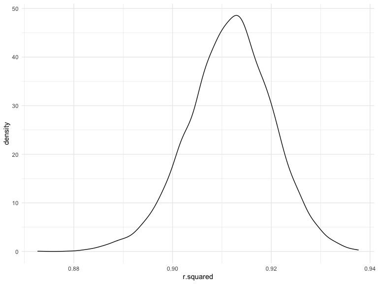
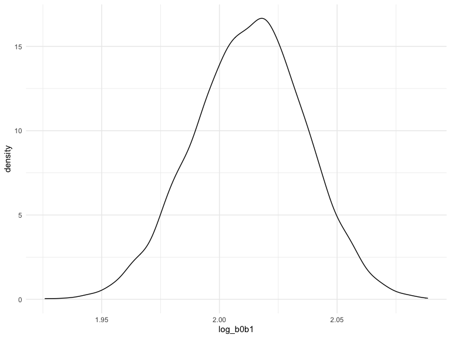
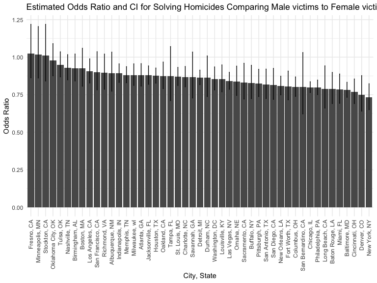
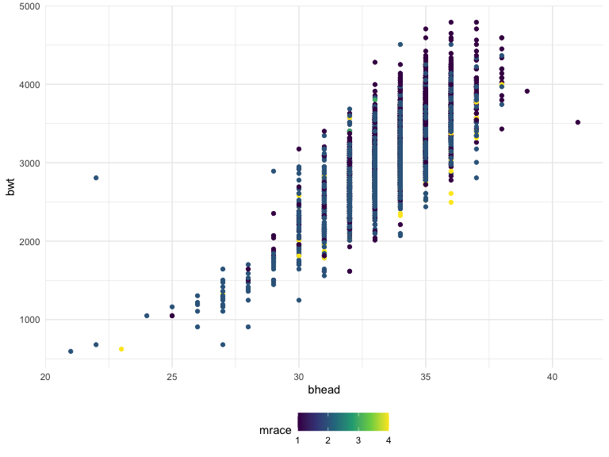
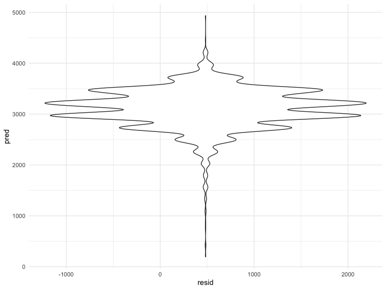
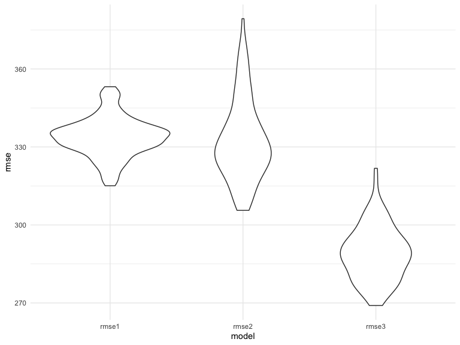

p8105_hw6_zz2780
================
Lydia Zhang
2022-12-01

# Problem 1

Load data

``` r
weather_df = 
  rnoaa::meteo_pull_monitors(
    c("USW00094728"),
    var = c("PRCP", "TMIN", "TMAX"), 
    date_min = "2017-01-01",
    date_max = "2017-12-31") %>%
  mutate(
    name = recode(id, USW00094728 = "CentralPark_NY"),
    tmin = tmin / 10,
    tmax = tmax / 10) %>%
  select(name, id, everything())
```

    ## Registered S3 method overwritten by 'hoardr':
    ##   method           from
    ##   print.cache_info httr

    ## using cached file: ~/Library/Caches/R/noaa_ghcnd/USW00094728.dly

    ## date created (size, mb): 2022-10-05 20:20:56 (8.408)

    ## file min/max dates: 1869-01-01 / 2022-10-31

Distribution of $\hat{r}^2$

``` r
weather_df %>% 
  modelr::bootstrap(n = 5000) %>% 
  mutate(
    models = map(strap, ~lm(tmax ~ tmin, data = .x) ),
    results = map(models, broom::glance)) %>% 
  select(-strap, -models) %>% 
  unnest(results) %>% 
  ggplot(aes(x = r.squared)) + geom_density()
```



Distribution of $\log(\beta_0 * \beta1)$

``` r
weather_df %>% 
  modelr::bootstrap(n = 5000) %>% 
  mutate(
    models = map(strap, ~lm(tmax ~ tmin, data = .x) ),
    results = map(models, broom::tidy)) %>% 
  select(-strap, -models) %>% 
  unnest(results) %>% 
  select(id = `.id`, term, estimate) %>% 
  pivot_wider(
    names_from = term, 
    values_from = estimate) %>% 
  rename(beta0 = `(Intercept)`, beta1 = tmin) %>% 
  mutate(log_b0b1 = log(beta0 * beta1)) %>% 
  ggplot(aes(x = log_b0b1)) + geom_density()
```



# Problem 2

Load the data from Github Repo

``` r
data2<-read.csv("https://raw.githubusercontent.com/washingtonpost/data-homicides/master/homicide-data.csv")
```

The code below creates a city_state variable and a binary variable
solved indicating whether the homicide is solved, omits cities with
missing race or mistake, limits the victim’s race to only white or
black, and changes victim_age to numeric variable.

``` r
data2<-data2%>%
  mutate(
    city_state=paste(city, state, sep=", "),
    solved=if_else(str_starts(disposition, "Closed"),1,0),
    victim_age=as.numeric(victim_age))%>%
  filter(
   !city_state %in% c("Dallas, TX", "Phoenix, AZ", "Kansas City, MO", "Tulsa, AL"),
   victim_race %in% c("White", "Black")
  )
```

After subset the dataset to only for city of Baltimore, I ran a glm on
the dataset with solved/unsolved homocide as outcome, and victim’s age,
sex, and race as predictors.

``` r
data2_baltimore=data2%>%
  filter(
    city_state=="Baltimore, MD"
  )

fit=glm(solved ~ victim_age + victim_sex + victim_race, data=data2_baltimore)
```

The code below tidy the glm output, and obtains the odds ratio and its
95% confidence interval for solving homicides comparing male victims to
female victims keeping all other variables fixed.

``` r
fit%>%
  broom::tidy()%>%
  select(term, estimate, std.error)%>%
  filter(term=="victim_sexMale")%>%
  mutate(
    odds_ratio=exp(estimate),
    lower_ci=exp(estimate-1.96*std.error),
    upper_ci=exp(estimate+1.96*std.error)
  )%>%
  select(-estimate, -std.error)
```

    ## # A tibble: 1 × 4
    ##   term           odds_ratio lower_ci upper_ci
    ##   <chr>               <dbl>    <dbl>    <dbl>
    ## 1 victim_sexMale      0.781    0.733    0.833

The code below runs glm for every city in the data set and saves the glm
output in results, which is then unnested.

``` r
nest_data2<-data2%>%
  nest(data=-city_state)%>%
  mutate(
    models=purrr::map(data,~glm(solved ~ victim_age + victim_sex + victim_race, data=.x)),
    results=purrr::map(models, broom::tidy)
  )%>%
  select(-data, -models)%>%
  unnest(results)
```

The code below creates a dataframe odds_ratio_sex that stores the
estimate and confidence interval of the adjusted odds ratio for solving
homicides comparing male victims to female victims for every city,
keeping all other variables fixed

``` r
odds_ratio_sex<-nest_data2%>%
  select(city_state, term, estimate, std.error)%>%
  filter(term=="victim_sexMale")%>%
  mutate(
    odds_ratio=exp(estimate),
    lower_ci=exp(estimate-1.96*std.error),
    upper_ci=exp(estimate+1.96*std.error)
  )%>%
  select(-term, -estimate, -std.error)

odds_ratio_sex
```

    ## # A tibble: 47 × 4
    ##    city_state      odds_ratio lower_ci upper_ci
    ##    <chr>                <dbl>    <dbl>    <dbl>
    ##  1 Albuquerque, NM      0.894    0.774    1.03 
    ##  2 Atlanta, GA          0.879    0.807    0.957
    ##  3 Baltimore, MD        0.781    0.733    0.833
    ##  4 Baton Rouge, LA      0.788    0.691    0.899
    ##  5 Birmingham, AL       0.927    0.842    1.02 
    ##  6 Boston, MA           0.924    0.806    1.06 
    ##  7 Buffalo, NY          0.828    0.724    0.946
    ##  8 Charlotte, NC        0.868    0.803    0.938
    ##  9 Chicago, IL          0.800    0.764    0.836
    ## 10 Cincinnati, OH       0.769    0.691    0.855
    ## # … with 37 more rows

The barplot plot_or shows the estimated ORs and CIs for solving
homicides comparing male and female victims while keeping other
variables constant, in descending order of OR. The ORs are represented
by the bars and CIs are represented by the error bars.

We can observe that Stockton, CA has OR closest to 1, indicating that
solving homicides in Stockton, CA does not associate with victim’s
gender. Only Fresno, CA, Minneapolis, MN, and Stockton, CA have OR
greater than 1, meaning that all other cities would be more likely to
solve the homicide if the victim is female, with New York City has the
lowest OR.

``` r
plot_or<- ggplot(odds_ratio_sex, aes(x =reorder(city_state, desc(odds_ratio)), y = odds_ratio)) +
  geom_bar(stat="identity")+
  geom_errorbar(width=.1, aes(ymin=lower_ci,ymax=upper_ci),position=position_dodge(width=0.5))+
  theme(axis.text.x = element_text(angle = 90, vjust = 0.5, hjust=1))+
  labs(x="City, State", y = "Odds Ratio",title="Estimated Odds Ratio and CI for Solving Homicides Comparing Male victims to Female victims in Each City")

plot_or
```



# Probelm 3

The code below loads the data, clean the variable names, and covert
numeric variables to factor where appropriate.

``` r
data3<-read_csv("birthweight.csv")%>%
  janitor::clean_names()%>%
  mutate(
    babysex<-as.factor(babysex),
    frace<-as.factor(frace),
    malform<-as.factor(malform),
    mrace<-as.factor(mrace)
  )
```

    ## Rows: 4342 Columns: 20
    ## ── Column specification ────────────────────────────────────────────────────────
    ## Delimiter: ","
    ## dbl (20): babysex, bhead, blength, bwt, delwt, fincome, frace, gaweeks, malf...
    ## 
    ## ℹ Use `spec()` to retrieve the full column specification for this data.
    ## ℹ Specify the column types or set `show_col_types = FALSE` to quiet this message.

I used complete.cases to check if data 3 has any row that have missing
values. It returns none, meaning the data has no missing value.

``` r
data3[!complete.cases(data3),]
```

    ## # A tibble: 0 × 24
    ## # … with 24 variables: babysex <dbl>, bhead <dbl>, blength <dbl>, bwt <dbl>,
    ## #   delwt <dbl>, fincome <dbl>, frace <dbl>, gaweeks <dbl>, malform <dbl>,
    ## #   menarche <dbl>, mheight <dbl>, momage <dbl>, mrace <dbl>, parity <dbl>,
    ## #   pnumlbw <dbl>, pnumsga <dbl>, ppbmi <dbl>, ppwt <dbl>, smoken <dbl>,
    ## #   wtgain <dbl>, babysex <- as.factor(babysex) <fct>,
    ## #   frace <- as.factor(frace) <fct>, malform <- as.factor(malform) <fct>,
    ## #   mrace <- as.factor(mrace) <fct>

I hypothesize that the baby’s head circumference is positively
associated with baby’s birthweight, so I plotted a graph using baby’s
head circumference against birthweight. I can observe a positive linear
trend, and I also hypothesize that mother’s race and its interaction
with head circumference are associated with birthweight.

``` r
data3%>%
  ggplot(aes(x=bhead, y=bwt, color=mrace))+
  geom_point()
```



I fitted a linear regression model with baby’s head circumference,
maternal race, and their interaction term as predictors and baby’s
birthweight as outcome.

``` r
model1<-lm(bwt~bhead*mrace, data=data3)
```

I added residuals and fitted values of the model and created a violin
plot of model residuals against fitted value.

``` r
data3 %>% 
  modelr::add_residuals(model1) %>% 
  modelr::add_predictions(model1)%>%
  ggplot(aes(x = resid, y = pred)) + geom_violin()
```



CV using crossv_mc comparing 3 models

``` r
cv_df =
  crossv_mc(data3, 100)%>%
  mutate(
    model1=purrr::map(train,~lm(bwt~bhead*mrace, data=.x)),
    model2=purrr::map(train,~lm(bwt~blength+gaweeks,data=.x)),
    model3=purrr::map(train,~lm(bwt~bhead*blength*babysex,data=.x))
  )%>%
  mutate(
    rmse1=purrr::map2_dbl(model1, test, ~rmse(model=.x, data=.y)),
    rmse2=purrr::map2_dbl(model2, test, ~rmse(model=.x, data=.y)),
    rmse3=purrr::map2_dbl(model3, test, ~rmse(model=.x, data=.y))
  )
```

Prediction error distribution plot for each model

``` r
cv_df %>% 
  select(starts_with("rmse")) %>% 
  pivot_longer(
    everything(),
    names_to = "model", 
    values_to = "rmse",
    names_prefix = "rmse_") %>% 
  mutate(model = fct_inorder(model)) %>% 
  ggplot(aes(x = model, y = rmse)) + geom_violin()
```



The RMSE of each model indicates that model 3 is better than the other
two models.
